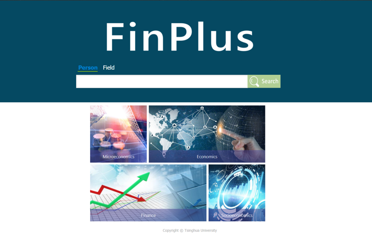

# FinPlus_SearchEngine

FinPlus is a search engine with powerful data mining algorithms covering 20 thousand fileds. Besides basic searching function, it can be used to discover core experts and hot topics in different fields. 

What's more, you can easily obtain fastest growing topics according to  professional statistic analysis. The network of prestigious scholars and potential talents are displayed in a user-friendly visualized way, and more specific information about them are provided.

For a prestigious researcher, besides basic information and publications, FinPlus provides his or her academic community relation diagram. Additionally, their research interests and trend are shown. Highly related researchers are recommended, based on analysis of co-authorship and affiliation.

### Technology

Our team contains six students and I'm responsible for all front-end works and back-end works during three days' competitions.

Out system have three important parts in total:

- Front-end: a modified version of [AMiner](https://www.aminer.cn)
- Back-end: Django framework
- Database: MySQL

Because time was life during a short-term competition and my team was in lack of front-end developers, I didn't use Bootstrap or Vue.js. Instead I just referred to asome famous website and modifyied their html and css.

For back-end server, I'm good at flask\Django\PHP. Finally I choose to django just because of it's efficient development capability. Another reason is that my teammates didn't know PHP and most of them only specialized in Python.

MySQL is enough for our work and it's convenient.

### Screenshots

Index page: 

Core experts with his or her partners in economy fields.

